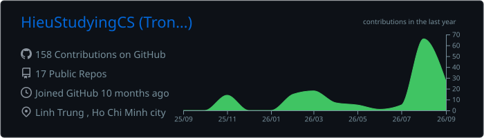
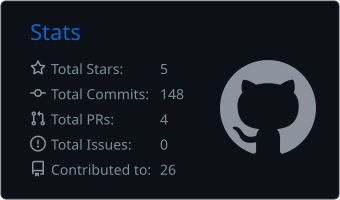
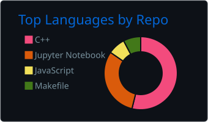

  

    
  
  
  <a href="https://github.com/HieuStudyingCS">
    
  </a>

## About me

I'm a **first-year Computer Science student** at [UIT - VNUHCM](https://www.uit.edu.vn/), with a deep passion for **Machine Learning/Deep Learning**, **Optimization**, and **AI Research**.

- 🎓 Currently exploring the mathematical foundations of CS and building AI/ML fundamentals.
- 👨‍💻 Active member at **Software Engineering Academic Club (BHTCNPM) UIT** and **GDGoC-HCMUS**.
- 🧠 Passionate about programming, algorithms, data structures, and problem solving through consistent practice and problem-solving discipline.
- 📊 **Targeting:** AI Research and solidifying my English proficiency (IELTS 7.0+).
- 📫 Always open to **academic discussions**, **collaborations**, and **learning opportunities**.
        
 

## Tech stack

<!-- 

  
  
   
  
  
  
  
  
   
  
  
  
  

 -->

**Languages & Web**

  
  

**AI/ML & Data Science**

  
  
  
  
  
  
  
  

**DevOps & Tools**

  
  
  
  
  
  
  

 

## Awards

<ul>
  <li><a href="https://drive.google.com/file/d/1jOZVsz6O7OdP4-VivTYLe5mD4CBvbCzN/view?usp=sharing">QuantVN Scholarship | QuantVN</a></li>
</ul>

 

## Experience

<h3>Undergraduate Researcher</h3>

<strong>ELO@UIT - Evolutionary Learning &amp; Optimization</strong> | <em>Advisor: Dr. Luong Ngoc Hoang</em> 
<em>May 2026 – Present</em> | Ho Chi Minh City, Vietnam

<ul>
  <li>Conducting comprehensive literature reviews on <strong>Evolutionary Algorithms</strong> to identify critical research gaps within the <strong>Optimization</strong> and <strong>Machine Learning</strong> domains.</li>
  <li>Collaborating on formulating methodologies and executing experiments to address identified gaps, contributing directly to the development of academic papers.</li>
</ul>

<h3>Official Trainer &amp; Academic Collaborator</h3>

<strong>Software Engineering Academic Club (UIT)</strong> 
<em>Feb. 2026 – Jul. 2026</em> | Ho Chi Minh City, Vietnam

<ul>
  <li>Led the club's Probability &amp; Statistics training sessions, simplifying complex mathematical theories and making it digestible and easy to understand for other students.</li>
  <li>Co-authored a <em>C++ Knowledge Handbook</em>, bridging the gap between low-level technical mechanics and real-world accessibility for beginners via highly visual code examples.</li>
</ul>

 

## Featured work

<table width="100%">
  <tr>
    <td width="50%" valign="top">
      <h3><a href="https://github.com/HieuStudyingCS/quantvn-vn-markets">QuantVN Markets</a></h3>
      
<em>RSI Vectorized Trading Strategy Research</em>

      

        
        
      

      
A Python-based quant research project built around an <strong>RSI Vectorized</strong> strategy for the Vietnamese market. The logic uses a 14-period RSI, buying when RSI drops below 30 and taking profit when it rises above 70, while keeping the full signal generation and backtest flow vectorized with <strong>Pandas</strong> for better performance on larger historical datasets. The project also includes edge-case handling for flat price movement and was used as part of a successful <strong>QuantVN Scholarship</strong> application.

      
<code>Python</code> · <code>Pandas</code> · <code>Technical Analysis</code> · <code>Backtesting</code> · <code>QuantVN</code>

    </td>
    <td width="50%" valign="top">
      <h3><a href="https://github.com/HieuStudyingCS/Strategy-Pattern-Performance-Benchmark">C++ Performance Benchmark</a></h3>
      
<em>Algorithm Efficiency Measurement System</em>

      

        
        
      

      
A comprehensive C++ benchmark program implementing Strategy and Dependency Injection patterns. Engineered with a production-grade workflow utilizing Conventional Commits, Husky hooks (pre-commit/pre-push), and automated CI/CD via GitHub Actions.

      
<code>C++</code> · <code>Design Patterns</code> · <code>Git Hooks</code> · <code>Husky</code> · <code>CI/CD</code>

    </td>
  </tr>
  <tr>
    <td width="50%" valign="top">
      <h3>Air Quality Prediction</h3>
      
<em>Club-level Machine Learning Competition</em>

      

        
      

      
Applied multi-task learning, classification, and regression techniques on air quality datasets to predict environmental metrics.

      
<code>Python</code> · <code>Scikit-learn</code> · <code>Pandas</code> · <code>EDA</code>

    </td>
    <td width="50%" valign="top">
      <h3><a href="https://github.com/HieuStudyingCS/LTH-Algorithm-Atlas">LTH Algorithm Atlas</a></h3>
      
<em>Algorithm &amp; Data Structures Solution Archive</em>

      

        
        
      

      
A personal algorithm atlas for documenting and practicing problems from <strong>LeetCode</strong>, <strong>CSES</strong>, and <strong>Codeforces</strong>. Each folder keeps the solution code together with a clear editorial so the approach, edge cases, and complexity analysis stay easy to review.

      
<code>C++</code> · <code>Python</code> · <code>Data Structures</code> · <code>Algorithms</code> · <code>Competitive Programming</code>

    </td>
  </tr>
</table>

 

## Education & Certifications

<h3>🎓 Education</h3>
<ul>
  <li><b>B.Sc. Computer Science</b> | University of Information Technology (UIT) - VNUHCM <i>(Expected 2029)</i></li>
  <li><b>Relevant Coursework</b>: Machine Learning, Probability & Statistics <i>(8.8)</i>, Linear Algebra <i>(9.6)</i>, Calculus <i>(9.8)</i>, Data Structures & Algorithms <i>(9.0)</i>, Discrete Structure <i>(9.9)</i></li>
</ul>

<h3>🏆 Certifications</h3>
<ul>
  <li><a href="https://www.coursera.org/account/accomplishments/verify/E2NDEOZMIGB9">Advanced Learning Algorithms | DeepLearning.AI & Stanford University</a></li>
  <li><a href="https://coursera.org/share/756b1dd6c1f1fd1eae810747169904c8">Supervised Machine Learning | Stanford University & DeepLearning.AI</a></li>
  <li><a href="https://coursera.org/share/253a76914c96a1b401e34b08d76be3a6">Google AI Essentials | Google Career Certificates</a></li>
  <li><a href="https://www.coursera.org/account/accomplishments/specialization/AJE916AKVU25?utm_source=link&utm_medium=certificate&utm_content=cert_image&utm_campaign=sharing_cta&utm_product=s12n">Google Prompting Essentials | Google Career Certificates</a></li>
  <li><a href="https://www.udemy.com/certificate/UC-1e4339dd-e676-46f5-b33c-a595f31f4bac/">Machine Learning Foundations - Full Stack AI Engineer | Data Science Academy</a></li>
  <li><a href="https://www.coursera.org/account/accomplishments/specialization/389ET1BA3WY3?utm_source=link&utm_medium=certificate&utm_content=cert_image&utm_campaign=sharing_cta&utm_product=prof">Google AI Professional | Google Career Certificates</a></li>
  <li><a href="https://drive.google.com/file/d/13iaBNWtVHphKfO4fSNK2zcUSCFDrBqaR/view?usp=sharing">Git Work-Ready | Rikkei Education</a></li>
  <li><a href="https://www.udemy.com/certificate/UC-b30977f7-dae5-49a2-8f91-8d656247f70f/">Become Experts in Python | Udemy</a></li>
  <li><a href="https://codelearn.io/share/ac6dc0f8-8af9-4b8e-8f9a-9fdc4d8dd928">Object-Oriented Programming in C++ | CodeLearn.io</a></li>
</ul>

 

## Contact

- **GitHub:** [HieuStudyingCS](https://github.com/HieuStudyingCS)
- **LinkedIn:** [Hieu Le](https://www.linkedin.com/in/1lth/)
- **CV:** [CV](https://drive.google.com/file/d/1MFwo0jmUyFbJ_d8OF1Qs2pzkeIMczfjB/view?usp=sharing)

 

## GitHub stats

  

  
  

  Cards are regenerated automatically by GitHub Actions so the numbers stay in sync with your latest public activity.

 

 

  

  <i>"Turning complex data into meaningful insights through analytical problem-solving."</i>

